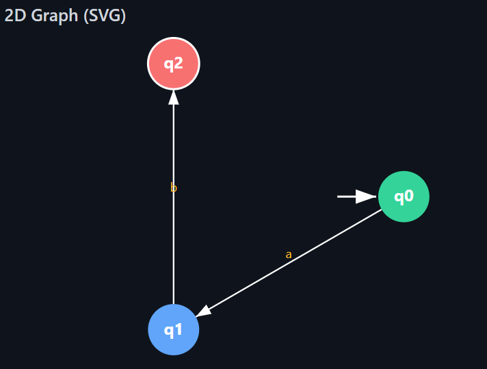
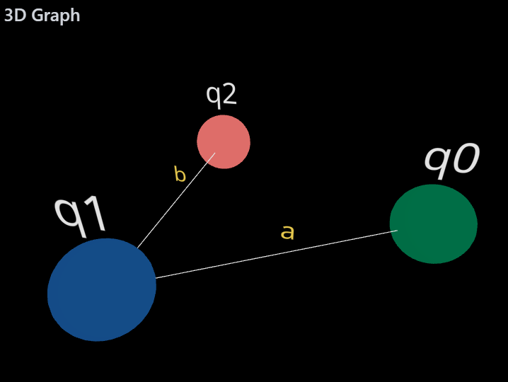

# Regular Expression to DFA Converter

This project is a web-based tool that converts regular expressions into Deterministic Finite Automata (DFA). It provides a user-friendly interface to input a regular expression and an alphabet, and then visualizes the resulting DFA in multiple formats, including a transition table, a 2D graph, and an interactive 3D graph.

The core logic, originally written in C++, has been translated to JavaScript to run entirely in the browser, providing a seamless and responsive user experience.

---

### Developed By

- **Name**: Adarsh Dhakar
- **Roll No**: 22CS01040

---

### Live Demo

*[Repo Link](https://github.com/adarshdhakar/reToDFA)*

*[Deployed Link](https://uppsskvp.netlify.app/)*

---

### Features

- **RE to DFA Conversion**: Implements the standard algorithm for converting a regular expression to an NFA (using Thompson's construction) and then to a DFA (using the subset construction method).
- **Implicit Concatenation**: Automatically adds concatenation operators (`.`) where needed, so users can write expressions like `(a+b)a` instead of `(a+b).a`.
- **Interactive UI**: A clean, modern interface built with React and styled with Tailwind CSS.
- **2D Graph Visualization**: Renders a clear and static 2D graph of the DFA using SVG.
- **Interactive 3D Graph**: Provides a dynamic 3D visualization of the DFA using `react-three-fiber`, allowing users to rotate, pan, and zoom.
- **Detailed Transition Table**: Displays the complete DFA transition table, clearly marking the start and final states.
- **Real-time Validation**: Provides instant feedback for invalid regular expressions, such as mismatched parentheses.

---

### Screenshots

| 2D Graph View | 3D Graph View |
| :---: | :---: |
|  |  |

---

### Technology Stack

- **Frontend**: [React](https://reactjs.org/)
- **3D Rendering**: [Three.js](https://threejs.org/) via [React Three Fiber](https://docs.pmnd.rs/react-three-fiber) & [Drei](https://github.com/pmndrs/drei)
- **Styling**: [Tailwind CSS](https://tailwindcss.com/)
- **Language**: JavaScript (ES6+)
- **Build Tool**: [Vite](https://vitejs.dev/) (or Create React App)

---

### Getting Started

Follow these instructions to get a copy of the project up and running on your local machine for development and testing purposes.

#### Web Version

Follow these instructions to get a copy of the project up and running on your local machine.

**Prerequisites:**
You need to have [Node.js](https://nodejs.org/) (version 14 or later) and [npm](https://www.npmjs.com/) installed on your machine.

**Installation:**

1.  **Clone the repository:**
    ```bash
    git clone [https://github.com/adarshdhakar/reToDFA.git](https://github.com/adarshdhakar/reToDFA.git)
    cd reToDFA
    ```

2.  **Install the dependencies:**
    ```bash
    npm install
    ```

3.  **Run the development server:**
    ```bash
    npm run dev
    ```
    The application should now be running on `http://localhost:5173` (or another port if specified).

#### C++ Version (Command-Line)

Follow these instructions to run the original C++ implementation.

**Prerequisites:**
You need a C++ compiler, such as [G++](https://gcc.gnu.org/install/), installed on your system.

**Compilation & Execution:**

1.  **Navigate to the C++ source directory** (assuming it's in a folder named `cpp`):
    ```bash
    cd cpp 
    ```

2.  **Compile the code:**
    ```bash
    g++ regularExpressionToDFA.cpp -o re_to_dfa
    ```

3.  **Run the executable:**
    ```bash
    ./re_to_dfa
    ```
    The program will run in your terminal and prompt you for input.

---

### How to Use

1.  **Define the Alphabet**: In the "Alphabet" input field, enter the symbols of your alphabet, separated by commas (e.g., `a,b`).
2.  **Enter the Regular Expression**: In the "Regular Expression" field, type the expression you want to convert (e.g., `(a+b)*a`).
    - The application supports the following operators: `+` (union), `*` (Kleene star), and `.` (concatenation). Concatenation is often implicit.
3.  **Generate**: Click the "Generate DFA & Graph" button.
4.  **View Results**:
    - The **Processing Details** card shows the postfix version of your expression.
    - The **DFA Graphs** card displays the 2D and 3D visualizations. You can interact with the 3D graph by clicking and dragging to rotate, scrolling to zoom.
    - The **DFA Transition Table** provides a formal definition of the generated automaton.

---

